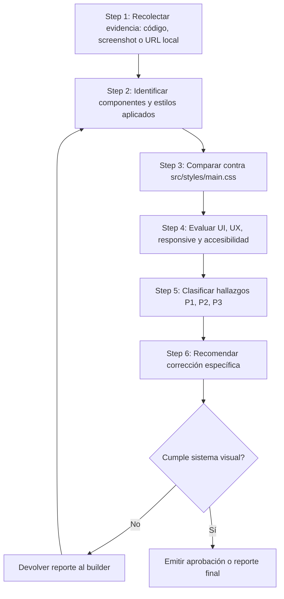

---

name: web-design-reviewer
description: Revisa la calidad visual, consistencia UI/UX, accesibilidad básica y cumplimiento del sistema de diseño Docencia 4.0. Úsalo para auditar componentes React/Next.js, HTML/CSS, Tailwind, shadcn/ui, dashboards, login, módulos educativos e interfaces responsive. Actúa como auditor estricto del uso de `src/styles/main.css` como fuente única de verdad visual.
license: Complete terms in LICENSE.txt
--------------------------------------

# Web Design Reviewer — Docencia 4.0

Esta habilidad permite inspeccionar, validar y reportar la calidad visual de las interfaces de Docencia 4.0. Su función principal es actuar como auditor de UI/UX y guardián del sistema de diseño, verificando que las pantallas y componentes construidos por `web-artifacts-builder` o diseñados por `frontend-design` respeten los tokens, clases, patrones visuales y criterios de accesibilidad definidos en `src/styles/main.css`.

Este agente no crea una nueva dirección visual. Evalúa si la implementación cumple con la identidad oficial de Docencia 4.0 y recomienda correcciones concretas cuando detecta desviaciones.

## Objetivo principal

Validar que la interfaz:

* Use `src/styles/main.css` como fuente única de verdad visual.
* No duplique tokens en archivos paralelos.
* No introduzca colores, fuentes, radios, sombras o gradientes fuera del sistema.
* Use correctamente los patrones de Docencia 4.0: tarjetas suaves, CTA naranja, cyan como marca/progreso, teal profundo para énfasis institucional y fondos slate claros.
* Mantenga consistencia visual entre dashboard, login, módulos, recursos, actividades y pantallas educativas.
* Sea responsive, legible y accesible.

## Alcance de aplicación

Esta habilidad aplica a:

* Componentes React o Next.js dentro del workspace de Antigravity.
* HTML, CSS, Tailwind CSS y shadcn/ui.
* Dashboards, páginas de login, módulos educativos, páginas internas, recursos descargables, actividades y componentes interactivos.
* Revisión de pantallas desktop, tablet y mobile.
* Auditoría de estados visuales: default, hover, focus, active, disabled, loading, locked, completed y error.

## Fuente única de verdad

El archivo oficial del sistema visual es:

```text
src/styles/main.css
```

Este archivo contiene los Design Tokens y utilidades oficiales de Docencia 4.0. Durante la revisión, todo hallazgo visual debe evaluarse contra ese archivo.

Reglas:

* `main.css` es la referencia principal para colores, tipografías, sombras, radios, espaciados, botones, tarjetas, inputs, badges, progreso, login y dashboard.
* No se debe exigir `tokens.css` si el proyecto ya consolidó los tokens en `main.css`.
* No se deben aprobar estilos visuales que dependan de valores sueltos si ya existe un token o clase oficial.
* shadcn/ui debe estar adaptado al sistema Docencia 4.0, no conservar apariencia genérica.

## Reglas críticas de alineación visual

### 1. Validación de tokens

Rechazar o señalar:

* Colores hardcoded en componentes: `#006688`, `#00C2FF`, `rgb(...)`, `hsl(...)`, etc., cuando exista token equivalente.
* Sombras hardcoded cuando exista `--shadow-*`.
* Radios hardcoded cuando exista `--radius-*` o clase oficial.
* Espaciados arbitrarios excesivos cuando puedan resolverse con la escala oficial.
* Fuentes no oficiales como Inter, Roboto o system-only cuando contradigan la marca.

Aprobar:

* Uso de variables como `var(--color-brand-primary)`, `var(--color-brand-secondary)`, `var(--color-text-display)`, `var(--color-background-page)`, `var(--color-background-surface)`, `var(--shadow-floating)`, `var(--radius-xl)`, etc.
* Uso de clases oficiales como `.btn-primary`, `.card-module`, `.card-feature`, `.card-inverse`, `.input`, `.searchbar`, `.badge`, `.progress`, `.auth-page`, `.auth-shell`.

Excepciones:

* Los valores hexadecimales dentro de `src/styles/main.css` son válidos porque allí se definen los tokens base.
* Valores inline pueden aceptarse solo si son temporales, están justificados y no existe token equivalente.
* Valores técnicos no visuales, como dimensiones de canvas, coordenadas SVG o cálculos de layout muy específicos, pueden aceptarse si no reemplazan un token visual existente.

### 2. Border radius

Verificar que:

* Tarjetas principales usen radios amplios: `--radius-lg`, `--radius-xl`, `.card-module`, `.card-feature`, `.card-inverse`.
* Botones e inputs principales usen estilo pill: `--radius-pill`, `.btn`, `.input`, `.searchbar`.
* Badges y progreso usen `--radius-pill`.
* No existan esquinas duras o radios de 0px salvo en imágenes, separadores o elementos donde el diseño lo justifique.

Señalar:

* Tarjetas con `border-radius: 4px` u `8px` si rompen la identidad visual.
* Mezcla inconsistente de radios pequeños y grandes en una misma sección.
* Componentes shadcn con radios por defecto que no armonizan con el sistema Docencia 4.0.

### 3. Superficies glass y tarjetas translúcidas

El sistema usa `.bg-glass` y `.card-glass` como utilidades oficiales.

Verificar:

* Uso de `.bg-glass` o `.card-glass` cuando se solicite efecto glass.
* Presencia de `backdrop-filter` mediante el token `--blur-card-glass` o `--blur-lg`.
* Contraste suficiente del texto sobre fondos translúcidos.
* Uso moderado de glassmorphism en pantallas educativas o densas.

Señalar:

* Uso de una clase `.glass` si no existe en `main.css`.
* Fondos transparentes que reducen legibilidad.
* Glassmorphism usado como decoración sin propósito funcional.

### 4. Tipografía

Verificar que:

* Titulares usen Plus Jakarta Sans mediante tokens o clases: `--font-family-heading`, `.text-display`, `.text-display-dashboard`, `.text-display-auth`, `.text-h1`, `.text-h2`, `.text-h3`.
* Texto de cuerpo use Manrope mediante `--font-family-body`, `.text-body`, `.text-body-sm`.
* La jerarquía de H1, H2 y H3 sea clara.
* El login, dashboard y módulos tengan titulares proporcionados al contexto.
* El tamaño de texto sea cómodo para una experiencia educativa.

Señalar:

* Uso de fuentes ajenas a la marca.
* Párrafos largos en fuente display.
* Titulares principales sin jerarquía o con tamaños inconsistentes.
* Texto demasiado pequeño para instrucciones, módulos, actividades o formularios.

### 5. Color semántico

Verificar:

* Cyan para marca, progreso, estado activo, indicadores y acentos informativos.
* Naranja para CTA principal, avance, continuar lección, comenzar módulo o acciones destacadas.
* Teal profundo para tarjetas destacadas, hero, branding institucional y fondos oscuros.
* Verde para progreso completado o éxito.
* Neutrales slate para superficies, inputs, tracks y fondos secundarios.

Señalar:

* Uso excesivo de todos los colores en un mismo viewport.
* CTA principal en color incorrecto.
* Texto cyan sobre fondo claro con bajo contraste.
* Gradientes ajenos a Docencia 4.0, especialmente purple gradients genéricos.
* Colores usados solo por preferencia estética y no por rol semántico.

### 6. Componentes clave

#### Botones

Verificar:

* CTA principal con `.btn .btn-primary` o equivalente tokenizado.
* Acciones secundarias con `.btn-secondary`, `.btn-tertiary` o `.btn-ghost`.
* Estados `hover`, `focus`, `active` y `disabled`.
* Tamaño táctil adecuado.

Señalar:

* `<Button variant="default">` de shadcn usado como CTA principal sin ajuste visual.
* Botones sin foco visible.
* Botones pequeños o poco claros en mobile.

#### Tarjetas de módulo

Verificar:

* Uso de `.card-module`.
* Estados visuales esperados: `.is-orange`, `.is-cyan`, `.is-locked`, completado y en curso.
* Barras de progreso con `.progress` y `.progress-fill`.
* Badges de estado cuando aplique.

Señalar:

* Módulos visualmente planos o indistinguibles.
* Módulos bloqueados sin tratamiento visual claro.
* Progreso representado con colores o estilos fuera del sistema.

#### Login

Verificar:

* Uso de `.auth-page`, `.auth-shell`, `.auth-panel-left`, `.auth-panel-right`.
* Inputs con `.input`.
* CTA principal con `.btn-primary`.
* Jerarquía clara entre panel visual y formulario.
* Buen contraste y alineación en desktop y mobile.

Señalar:

* Login con apariencia genérica de plantilla.
* Inputs que no usan los tokens oficiales.
* Panel visual saturado o desconectado del sistema Docencia 4.0.

#### Dashboard

Verificar:

* Fondo general con `.bg-page` o `var(--color-background-page)`.
* Tarjetas laterales con `.card-feature` o `.card-inverse`.
* Barra de búsqueda con `.searchbar`.
* Badges con `.badge` y variantes semánticas.
* Progreso visual claro y consistente.

Señalar:

* Cards sin jerarquía.
* Sidebars o topbars con colores fuera del sistema.
* Elementos de progreso poco claros o inconsistentes.

## Revisión responsive

Validar en al menos:

* Desktop: 1440px o similar.
* Tablet: 768px.
* Mobile: 390px o 430px.

Verificar:

* No hay overflow horizontal.
* El contenido refluye adecuadamente.
* Los botones siguen siendo tocables.
* Los titulares no se rompen de forma incómoda.
* Las tarjetas mantienen jerarquía y respiración visual.
* La navegación sigue siendo usable.
* El login y dashboard mantienen coherencia visual en mobile.

## Revisión de accesibilidad básica

Verificar:

* Contraste suficiente en texto, botones, badges y tarjetas oscuras.
* Estados focus visibles.
* Navegación por teclado básica.
* Uso adecuado de `alt` en imágenes informativas.
* Jerarquía semántica de headings.
* Uso de landmarks: `header`, `main`, `nav`, `section`, `footer` cuando aplique.
* Tamaño mínimo razonable para áreas táctiles.
* Mensajes de error o estados importantes que no dependan únicamente del color.

## Flujo de trabajo



## Severidad de hallazgos

### P1 — Crítico

Problemas que rompen identidad, accesibilidad o funcionalidad principal:

* `main.css` no está importado.
* Uso generalizado de estilos hardcoded.
* CTA principal con color o estilo incorrecto.
* Pantalla no responsive.
* Contraste insuficiente en texto esencial.
* shadcn/ui sin adaptación a la marca.
* Login, dashboard o módulo principal con estructura visual incompatible con Docencia 4.0.

### P2 — Importante

Problemas visibles pero no bloqueantes:

* Radios inconsistentes.
* Espaciado irregular.
* Jerarquía tipográfica débil.
* Estados hover/focus incompletos.
* Uso parcial de tokens.
* Tarjetas visualmente cercanas, pero no totalmente alineadas.
* Responsive funcional, pero visualmente pobre.

### P3 — Mejora

Ajustes de refinamiento:

* Microinteracciones mejorables.
* Mejor uso de ritmo visual.
* Pequeños ajustes de sombra, alineación o densidad.
* Texto o microcopy que podría ser más claro.
* Oportunidades para simplificar clases repetitivas.

## Formato del reporte

Usar este formato al finalizar una revisión:

````md
# Docencia 4.0 — Web Design Review Results

## Summary

| Target | Framework | Styling | Tested Viewports | Issues Detected | Fixed |
|---|---|---|---|---:|---:|
| {URL / Page / Component} | {React/Next/HTML} | {CSS/Tailwind/shadcn} | {Desktop, Tablet, Mobile} | {N} | {M} |

## Verdict

{Approved / Approved with minor fixes / Requires revision}

## Detected Issues & Token Violations

### [P1] {Issue Title}

- **Page/Component**: `{Page path or component name}`
- **Element**: `{Selector or component}`
- **Violation**: {Describe the issue}
- **Evidence**: {Code reference, screenshot note, or visual observation}
- **Recommended Fix**: {Exact class/token to apply}
- **Suggested Code**:

```tsx
// Optional corrected snippet
```

### [P2] {Issue Title}

- **Page/Component**: `{Page path or component name}`
- **Element**: `{Selector or component}`
- **Violation**: {Describe the issue}
- **Recommended Fix**: {Exact class/token to apply}

## Unfixed Issues Requiring Human Review

### {Issue Title}

- **Reason**: {Why it was not fixed automatically}
- **Decision Needed**: {What the human director must decide}

## Positive Findings

- {What is correctly aligned with Docencia 4.0}
- {Good use of tokens, responsive behavior, accessibility or UI hierarchy}

## Final Recommendation

{Concise next step}
````

## Antipatrones a rechazar

* Usar `tokens.css` como fuente paralela cuando el proyecto usa `main.css`.
* Duplicar tokens dentro de componentes.
* Usar colores hardcoded en JSX o CSS del componente.
* Usar Inter u otra fuente ajena como fuente principal.
* Mantener apariencia genérica de shadcn/ui.
* Usar `.glass` si la utilidad oficial disponible es `.bg-glass` o `.card-glass`.
* Usar `--radius-full` si el token oficial es `--radius-pill`.
* Usar `--font-display` o `--font-body` si los tokens oficiales son `--font-family-heading` y `--font-family-body`.
* Usar `--surface-container-lowest` si no existe en `main.css`.
* Usar gradientes morados o paletas ajenas.
* Aprobar pantallas sin estados focus visibles.
* Aprobar pantallas que se vean bien solo en desktop.
* Aprobar una pantalla con CTA principal ambiguo.
* Aprobar módulos educativos donde la jerarquía visual dificulte saber qué hacer primero.

## Relación con otros agentes

* `frontend-design`: define decisiones visuales, composición, registro y experiencia.
* `web-artifacts-builder`: implementa, estructura, integra shadcn/ui y empaqueta artefactos.
* `web-design-reviewer`: audita cumplimiento visual y recomienda correcciones.
* `web-design-guidelines`: contiene lineamientos de diseño, si está disponible en el proyecto.
* `qa-accessibility-reviewer`: puede complementar con auditoría más profunda de accesibilidad, si existe.
* `estratega-diseño-instruccional`: valida coherencia pedagógica de módulos y actividades.

## Definición de listo

Una revisión puede aprobarse cuando:

* `src/styles/main.css` está importado y activo.
* No hay tokens duplicados ni sistema visual paralelo.
* Los componentes usan variables o clases oficiales.
* La pantalla mantiene la identidad Docencia 4.0.
* CTA, tarjetas, inputs, badges y progreso siguen sus patrones oficiales.
* Hay responsive básico verificado.
* Hay contraste y foco visible suficientes.
* No quedan hallazgos P1.
* Los P2 restantes, si existen, están documentados y no bloquean el uso.
* La interfaz se siente educativa, profesional, clara y coherente con el ecosistema Docencia 4.0.

```
```
